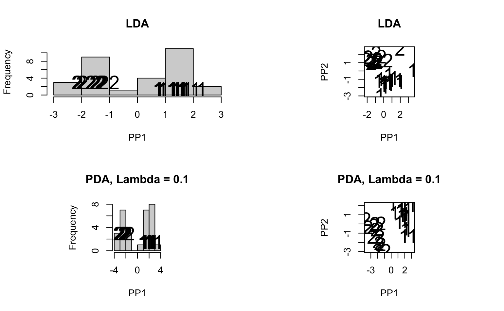
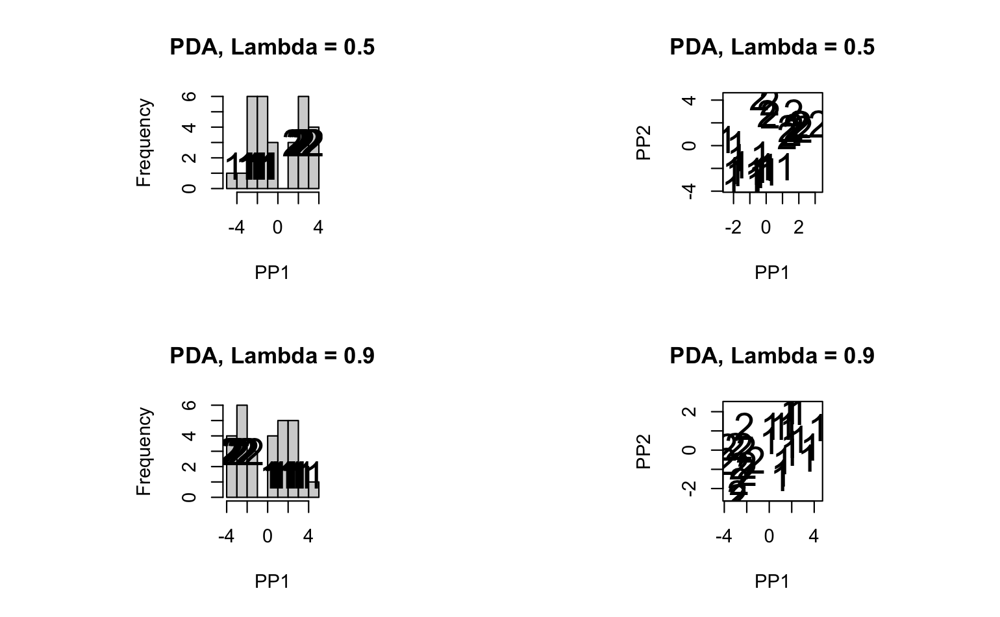
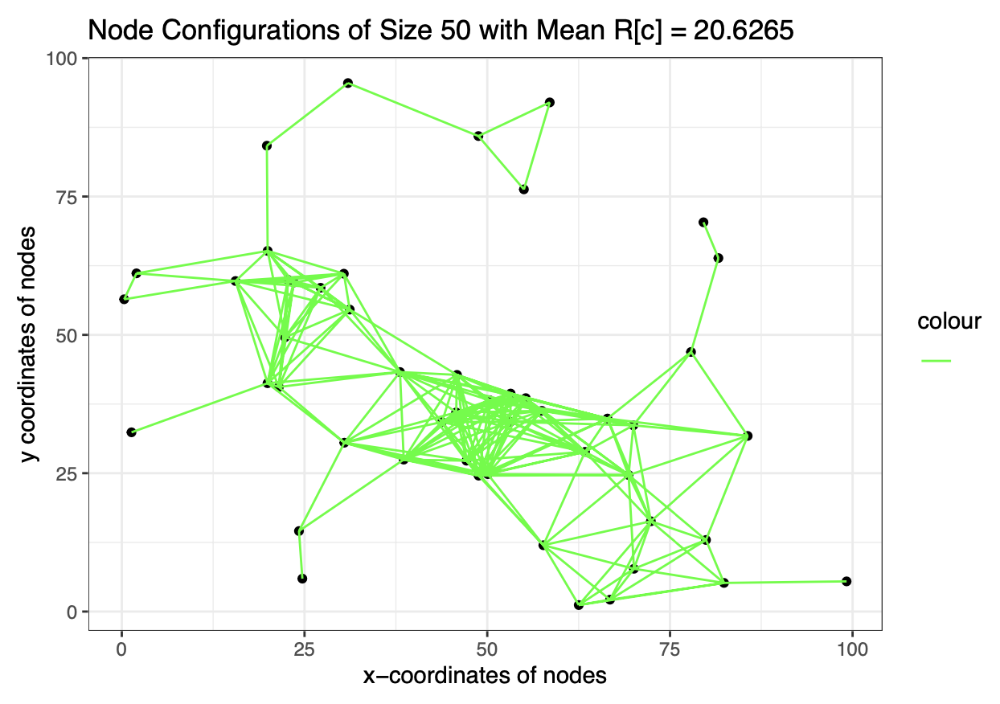

# About Page 👋

Hey there! I'm Elvin Liu, a 3rd year Statistics and Economics student at the University of Washington, Seattle. I'm also a Research Assistant for Professor Furfaro and a peer tutor at the Instructional Center. As part of the honors program for Statistics, I've prepared this ePortfolio. By the end, there should be at least 5 projects on here, some of which may be based on course projects, some of which may correspond to co-curriculuar activities.

I have a strong interest in research and am definitely considering graduate school. As such, most projects here will be academic in nature, with the small exception of some machine learning projects that I did for fun.

More information about the particular projects I've completed can be found in the dedicated [section](projects/) for them. On top of that I have a brief, non-technical summary for each project and some tentative plans below.

---

As of right now, I have completed 4 projects (however only 3 of them are showcased on GitHub). In chronological order:

## Project 1
- From the summer of my freshman year to the winter of my sophomore, I participated with one of my friends in the **[eBay 2023 University Machine Learning Competition](projects/project1/)**, where we built a model that can accurately identify, extract, and label "named entities" using a machine learning process known as Named Entity Recognition (NER). We ended up qualifying for the final round and ultimately placed 12th out of 887 participating teams. It was a fun experience that took a lot of `Python` coding and independent research into niche topics. I also got to use cloud services for the first time to train our models. We may've gone a little overboard and went way over budget training our NLP models on AWS GPU's though...

  

## Project 2
- In the autumn of 2023, I participated in a SPA DRP and researched methods to **[Classify High-Dimensional Data](projects/project2/)** under my mentor, Statistics PhD student [Zhaoxing Wu](https://stat.uw.edu/about-us/people/zhaoxing-wu). High dimensionality poses significant statistical challenges and renders many traditional classification algorithms impractical to use, so I explored Linear Discriminant Analysis and Penalized Discriminant Analysis as alternative techniques. The intuition behind the matrix algebra wasn't pretty. I ended up producing `R` methods for comparing the performances of different supervised models (e.g. support vector machines) on small n large p datasets like gene expression. At the end of the quarter, I presented a slideshow summary of my findings to graduate students.

  
   

## Project 3
- During the winter quarter of my sophomore year, my final project for STAT 302, Statistical Computing, was the completion of a fully connected **[Ad hoc Network](projects/project3/)** in `R`. Specifically, we were expected to find, via matrix algebra, the smallest edge length that connected every single node on a randomly distributed graph. We then produced the fully connected network and compared some statistics (e.g. average edge length). The programming portion was far simpler than figuring out which sets of mathematical operations yielded the desired outcome.

  

## Project 4
- During spring 2024, my final project for STAT 342, Introduction to Probability and Mathematical Statistics III, required a 20 page paper on hypothesis testing for the efficacy of the Pfizer COVID-19 vaccine. The PDF of the paper can be found [here](https://drive.google.com/file/d/1brgp9a-4Vha6H5EEwDVODDykNSq-ljQB/view?usp=sharing), but I haven't gotten around to gathering all of the materials for this portfolio just yet.

---

I also have 2 ongoing projects:

1. In the summer of 2024, [Professor Grove](https://stat.uw.edu/about-us/people/ranjini-grove) was kind enough to supervise my independent research on optimal chi-square confidence intervals. So far, I've finished the `R` code for optimizing, visualizing, and comparing different asymmetric confidence interval methods and have written a brief write-up. Although the project is still ongoing, ideally I can submit my studies to the undergraduate research project competition before December 18, 2024. More information pending.

2. Additionally, I'm fortunate enough to be an Undergraduate Research Assistant in the Department of Statistics at the University of Washington under [Professor Furfaro](https://stat.uw.edu/about-us/people/emanuela-furfaro-0). In July, I received a grant to assist with her ongoing research into sense of belonging in undergraduate statistics classes. The summer was spent going through literature, drafting survey questions, and experimental design. Over the course of the Fall and Winter we'll be collecting data from the survey questions and analyzing them.

---

Tentative Projects:

DataFest

Research REU (?)

SPA DRP

STAT 451 (Data Visualization)

STAT 498 (Special Topics)
