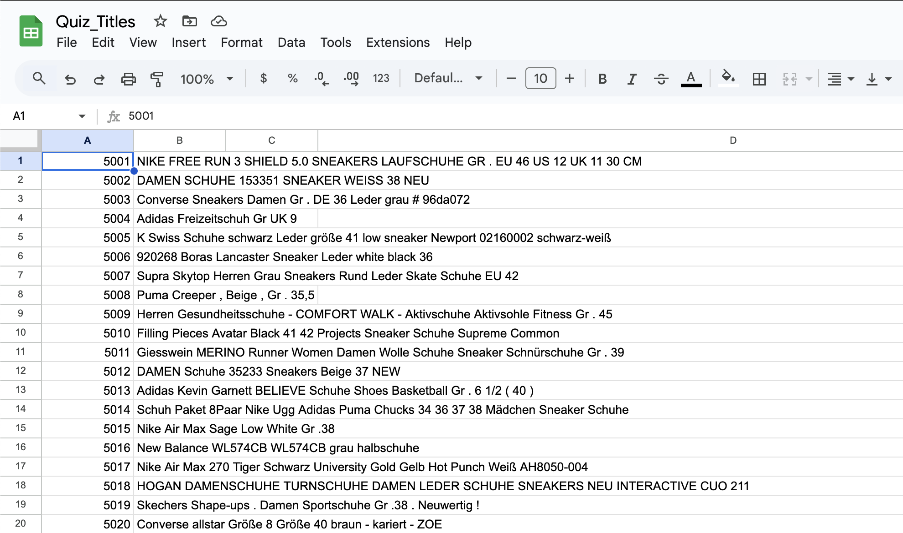
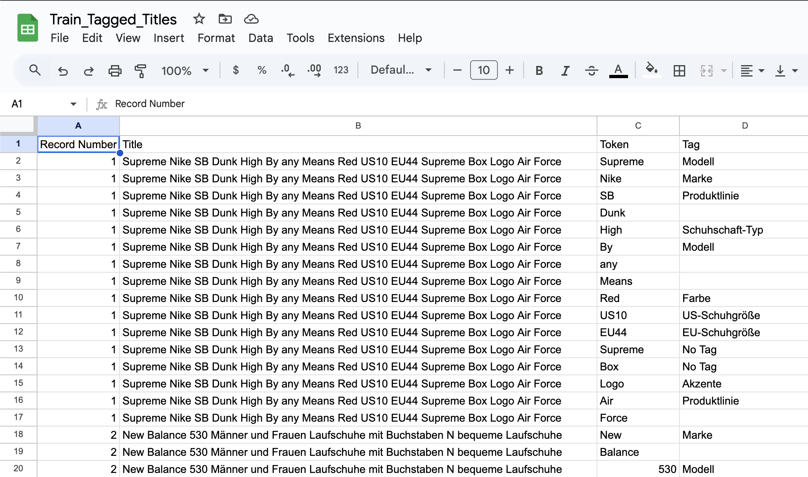
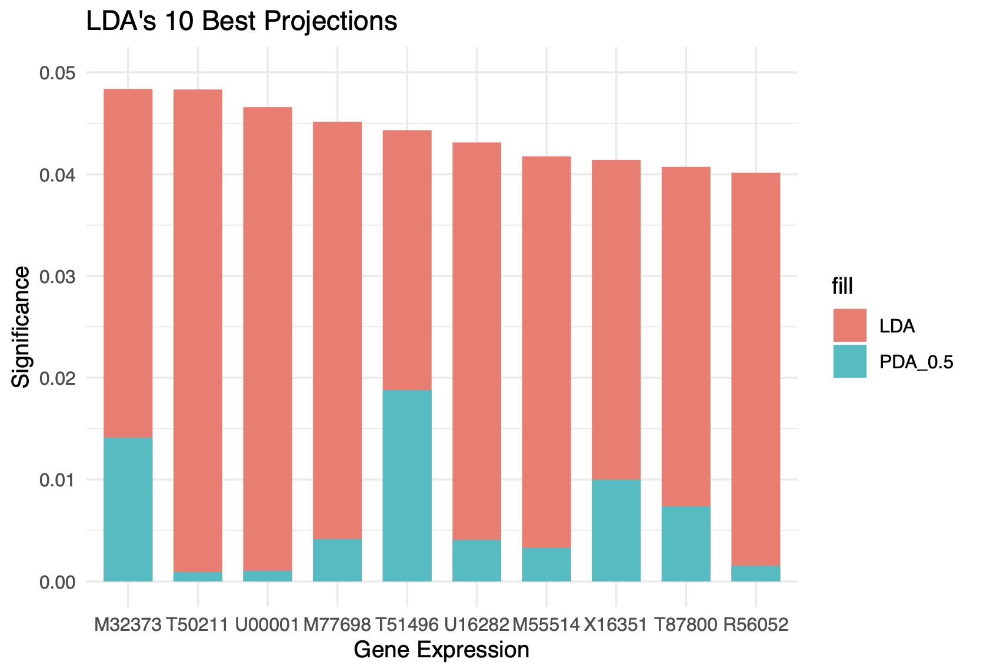

# List of Projects 📁

The assortment of projects below are part of my ePortfolio for the Statistics Honors Program. As of right now, only the first 3 projects are complete.

# Project 1: [eBay 2023 University Machine Learning Competition](project1/)

1. Built a named entity recognition natural language processing model in Python to translate and tokenize German eBay listings
2. Trained a token classification model using Hugging Face's Transformers library
3. Loaded Facebook's pre-trained roBERTa model into a PyTorch training loop and logged performance for future optimization with Wandb

  
  

# Project 2: [Classify High-Dimensional Data](project2/)

1. Implemented LDA and PDA in `R` as a way to reduce dimensions in high dimensional data
2. Visualized and compared the most important columns found from LDA and PDA on dummy examples
3. Analyzed performance of different supervised machine learning techniques on a real-life colon cancer dataset

  

# Project 3: [Ad hoc Network](project3/)

1. Produced `R` code to generate nodes for an ad hoc network according to some pre-specified node density
2. Found the smallest $R_c$ necessary to connect all nodes through some path in the network
3. Graphical analysis of the distributions of $R_c$, with particular interest in the minimum, mean, median, and maximum values

  <image src="./project3/img3/rc_median.png" width="95%"/>

# Project 4: [Tentative](project4/)

# Project 5: [Tentative](project5/)
